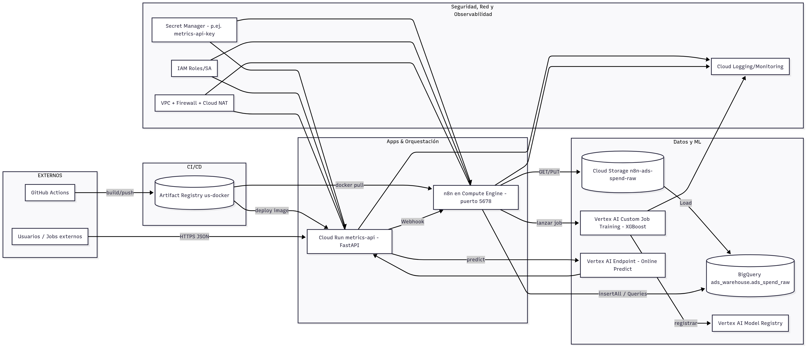
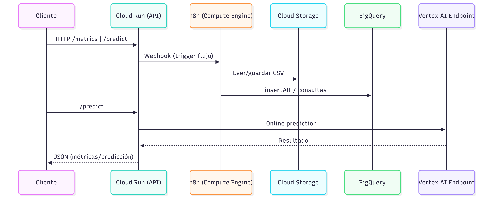
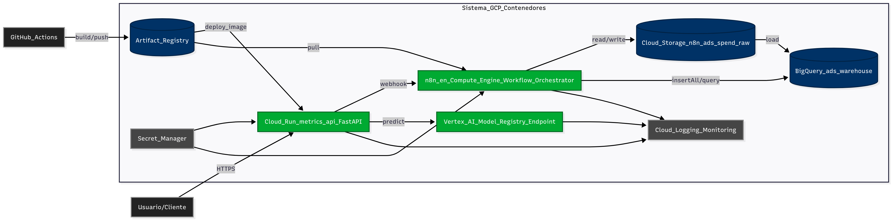
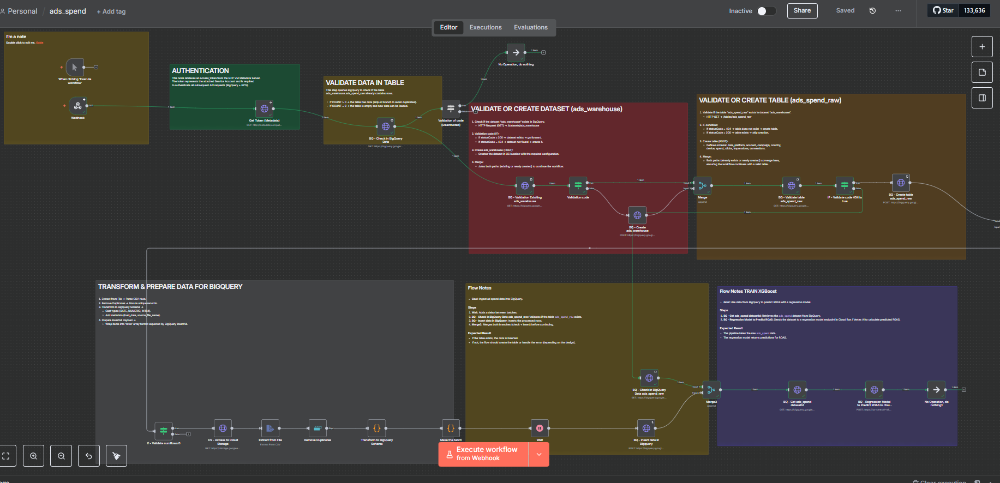

# GCP Ads Metrics Pipeline

Infra & code to ingest ads spend CSV → BigQuery, expose a FastAPI service on Cloud Run, orchestrate with n8n, and trigger a Cloud Function to run ML (XGBoost) for ROAS/CAC predictions.

> **Stack:** Artifact Registry · Cloud Run · BigQuery · Cloud Functions · n8n · FastAPI · GitHub Actions · (optional) Vertex AI

---

## Repository structure

```
.
├─ .github/
│  ├─ scripts/
│  │  └─ deploy_remote.sh
│  └─ workflows/
│     ├─ cicd.yml
│     ├─ deploy-cloudrun.yml
│     ├─ deploy-from-image.yml
│     └─ upload-dataset.yml
├─ api/
│  ├─ data/
│  ├─ domain/
│  ├─ routers/
│  ├─ services/
│  ├─ main.py
│  ├─ requirements.txt
│  └─ Dockerfile
├─ data/
│  └─ ads_spend.csv
├─ dbt/
├─ docker/
│  └─ Dockerfile
├─ docs/
│  └─ postman/
│     ├─ endpoints_cloud_run.json
│     └─ metrics-api.postman_collection.json
├─ infra/
│  └─ cloudrun/
│     └─ n8n/
│        └─ ads_spend_n8n.json
├─ notebooks/
│  └─ data/ads_spend.csv
├─ scripts/
│  ├─ cicd_save_v1.yml
│  ├─ granting_base_roles.sh
│  ├─ setup_n8n_bigquery.sh
│  ├─ setup_n8n_cloud_function.sh
│  ├─ setup_n8n_gcp.sh
│  └─ setup-ml-xboost-cloud-function.sh
├─ sql/
└─ tests/
```

---

## High‑level architecture

1. **Artifact Registry** stores container images (FastAPI + n8n).
2. **Cloud Run** hosts `metrics-api` exposing REST endpoints.
3. **BigQuery** stores raw + aggregated ads data.
4. **n8n** orchestrates ingestion and Cloud Function triggers.
5. **Cloud Function** runs XGBoost training/prediction.
6. **Postman** provides endpoint calls.



---

## API Endpoints

Below are the main endpoints available via **metrics-api** (Cloud Run service). Postman collection is provided in `postman/metrics-api.postman_collection.json`.

### Health & Root

* **GET /** → root status
* **GET /health** → service health check

### Metrics & Comparisons

* **GET /metrics/compare** → Compare periods (e.g., CAC, ROAS)
* **GET /metrics/months** → Available months

### Natural Language Query (NLQ)

* **POST /nlq/parse?execute=false** → Parse NLQ → SQL
* **POST /nlq/parse?execute=true** → Parse + execute NLQ → results

### Machine Learning (XGBoost)

* **POST /ml/xgboost/predict** → Predict with XGBoost
* **POST /ml/xgboost/predict-batch** → Batch prediction

### n8n Integration

* **GET /trigger-n8n/simple** → Trigger n8n webhook
* **GET /trigger-n8n/execute** → Execute extended n8n workflow

### BigQuery Diagnostics

* **GET /bq/diagnostics** → Run diagnostic query
* **GET /bq/table-exists** → Validate table existence

---

## Example curl calls

```bash
BASE="https://<cloud-run-url>"

# Health
curl -s "$BASE/health"

# Compare CAC/ROAS
curl -s "$BASE/metrics/compare?metric=CAC&range=30"

# NLQ parse (dry run)
curl -X POST "$BASE/nlq/parse?execute=false" -H 'Content-Type: application/json' \
  -d '{"q":"Compare CAC and ROAS for last 30 days vs prior 30 days"}'

# XGBoost Prediction
curl -X POST "$BASE/ml/xgboost/predict" -H 'Content-Type: application/json' \
  -d '{"model":"xgboost_roas_v1"}'

# Trigger n8n flow
curl -s "$BASE/trigger-n8n/simple"

# Check BigQuery table exists
curl -s "$BASE/bq/table-exists?dataset=ads_warehouse&table=ads_spend_raw"
```

---

## Permissions

* Artifact Registry: `roles/artifactregistry.reader`
* Cloud Run: `roles/run.admin`, `roles/iam.serviceAccountUser`
* BigQuery: `roles/bigquery.user`
* Cloud Functions: `roles/cloudfunctions.invoker`
* Storage: `roles/storage.objectViewer`

Helper: `scripts/granting_base_roles.sh`

---

## Local development

```bash
cd api
python -m venv .venv && source .venv/bin/activate
pip install -r requirements.txt
uvicorn main:app --host 0.0.0.0 --port 8080 --reload
```

---

---

##  How the system works (sequence flow)

The diagram below shows what happens behind the scenes when someone uses the API:

1. A **client** (you, a script, or Postman) calls the **Cloud Run API** through endpoints like `/metrics` or `/predict`.
2. Cloud Run can handle the request in two ways:
   - It can talk directly to **BigQuery** to run the needed queries.
   - Or it can fire a **webhook to n8n**, which takes care of orchestrating the flow.
3. **n8n** pulls in data from **Cloud Storage** (like CSV uploads) and pushes it into **BigQuery** using `insertAll` or SQL queries.
4. When a prediction is requested, **BigQuery** passes the data to a model — either on **Vertex AI Endpoint** or via a **Cloud Function running XGBoost**, depending on the setup.
5. The results make their way back through **Cloud Run**.
6. Finally, the **client** receives a clean JSON response with the metrics or predictions.




---

## How the container system fits together

This diagram gives a big-picture view of how all the parts of the project live and work inside GCP:

1. Everything starts in **GitHub Actions**, which builds our app into a Docker image and stores it safely in **Artifact Registry**.
2. **Cloud Run** then pulls that image and runs the **FastAPI service** — this is the front door of the system where clients make requests like `/metrics` or `/predict`.
3. When a request comes in:
   - Sometimes the API handles it on its own by talking to **BigQuery** or **Vertex AI**.
   - Other times, it kicks off an **n8n workflow** (running on Compute Engine) to handle the heavier lifting of orchestration.
4. **n8n** is the “traffic director” — it can grab CSVs from **Cloud Storage**, batch them up, and push them into **BigQuery** for storage and analysis.
5. **BigQuery** is where all the raw and processed ads data lives. It powers queries, dashboards, and training data for models.
6. For predictions, the data flows into a **Vertex AI model endpoint**, which runs the machine learning model and sends results back.
7. Behind the scenes, **Secret Manager** makes sure credentials and API keys stay secure, and **Cloud Logging & Monitoring** keeps track of what’s happening across services.
8. Finally, the **client** just sees a simple JSON response — whether that’s a metric comparison or a fresh prediction.

In short: GitHub builds it, Cloud Run serves it, n8n orchestrates it, BigQuery stores it, Vertex AI predicts it, and you get the answer back over HTTPS.




---

## n8n Workflow: Data ingestion & model training

This flow is the “glue” that connects Cloud Run, BigQuery, and XGBoost. Instead of having to create tables and upload files manually, the workflow makes sure everything is ready and then loads the data automatically.

### Step by step

1. **Webhook trigger**  
   The whole flow starts when Cloud Run or an external client hits the n8n webhook.  
   → This is like ringing the doorbell to wake up the workflow.

2. **Authentication (Get Token)**  
   Before doing anything with Google services, n8n authenticates against GCP using the metadata server or service account.  
   → Ensures all BigQuery and Cloud Storage calls are authorized.

3. **Validate if dataset exists (`ads_warehouse`)**  
   n8n checks BigQuery to see if the dataset already exists.  
   - If it does, move on.  
   - If not, it creates the dataset.  
   → This prevents errors from missing datasets.

4. **Validate or create table (`ads_spend_raw`)**  
   The same check is repeated for the table. If the table doesn’t exist, n8n creates it with the correct schema (date, platform, spend, impressions, conversions, etc.).  
   → This way, the data always has a “home” in BigQuery.

5. **Transform & prepare data**  
   Once the structure is in place, n8n takes the incoming CSV file and processes it:  
   - Access the file in Cloud Storage.  
   - Extract the contents.  
   - Remove duplicates.  
   - Transform fields to match the BigQuery schema.  
   - Make sure the format (types, nulls, etc.) is BigQuery-friendly.  
   → Think of this step as “cleaning and ironing” the data before storage.

6. **Insert into BigQuery**  
   The cleaned rows are inserted into the `ads_spend_raw` table using `insertAll`.  
   → The raw ads spend data is now available for queries and reporting.

7. **Train XGBoost (optional branch)**  
   After the data is in place, the flow can trigger a model training step:  
   - Select recent data from BigQuery.  
   - Run it through an XGBoost model (either via a Cloud Function or Vertex AI endpoint).  
   - Store or return the model’s predictions.  
   → This is how the system learns from the latest spend and performance data.

8. **Finish**  
   Once everything is complete, the workflow stops cleanly, ready to wait for the next webhook call.

---

### Why this matters
- **Automatic safety checks** → no more “table not found” errors.  
- **Consistent data** → all rows are cleaned and validated before hitting BigQuery.  
- **Built-in ML step** → no manual model retraining; the pipeline can trigger it as part of ingestion.  
- **Human-friendly** → you just send a file or trigger the webhook, and the workflow handles the rest.




## Roadmap

* Add Vertex AI for scalable ML jobs
* Add DBT models for aggregations
* Schedule ingestion with Cloud Scheduler

---

**Owner:** Octavio · **Project:** Ads Metrics & ML Pipeline
